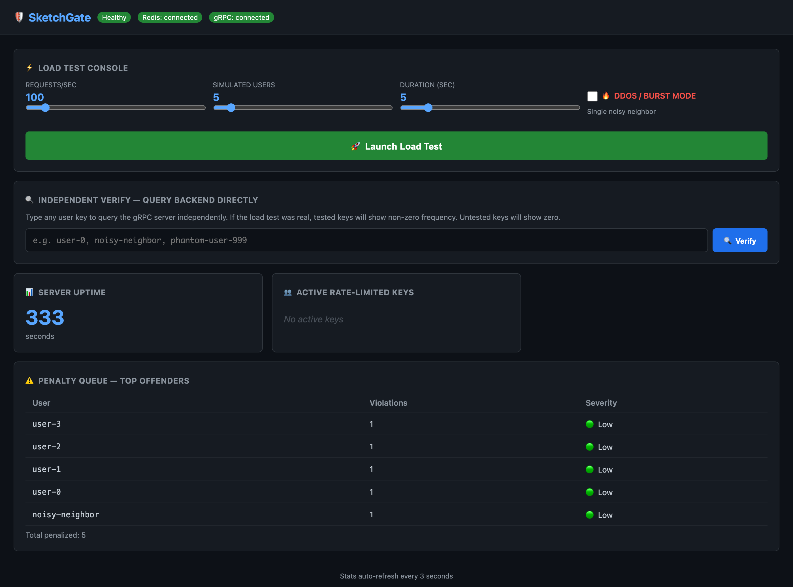
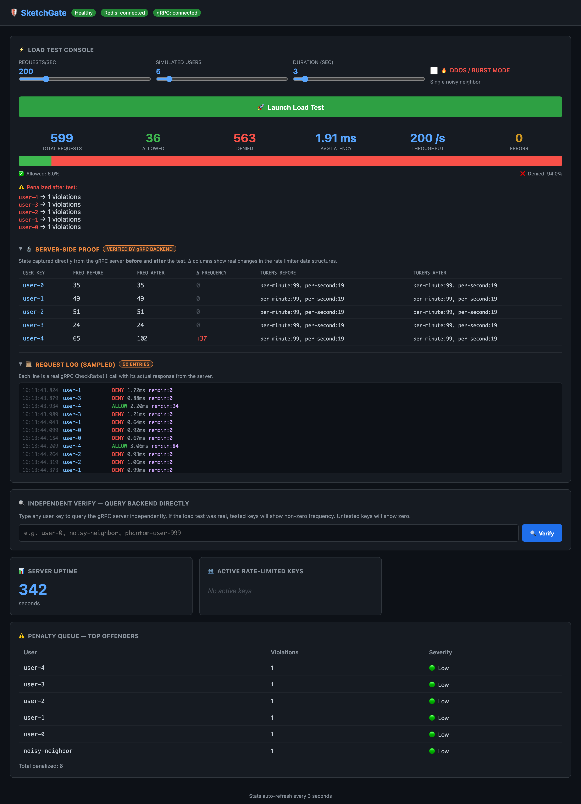
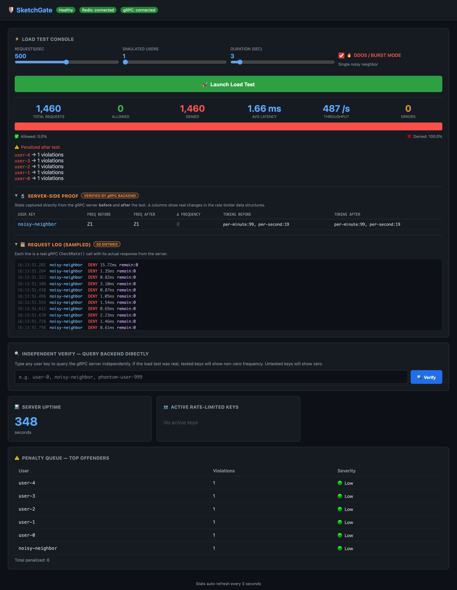
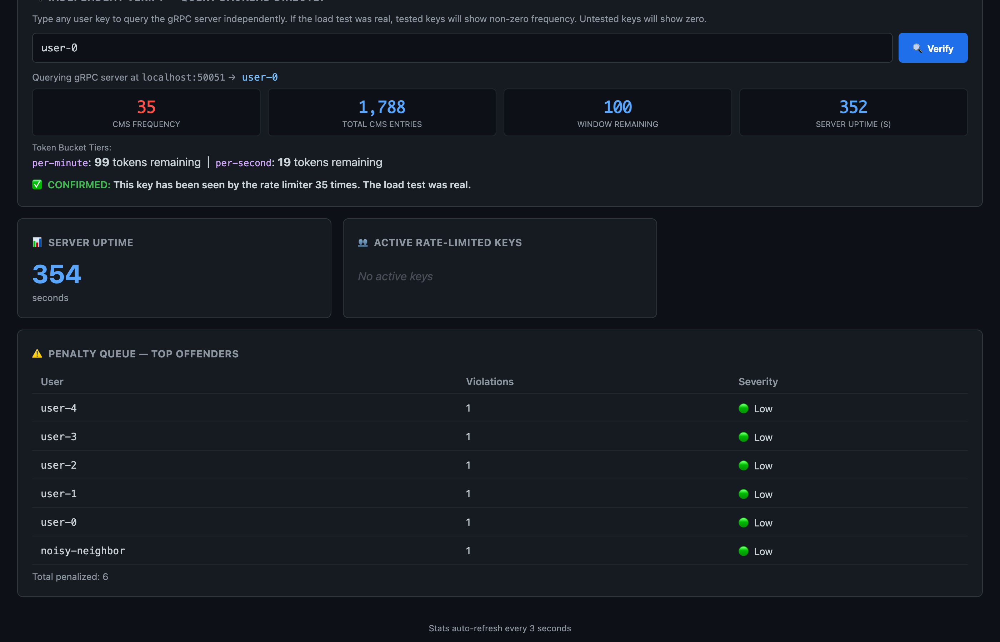
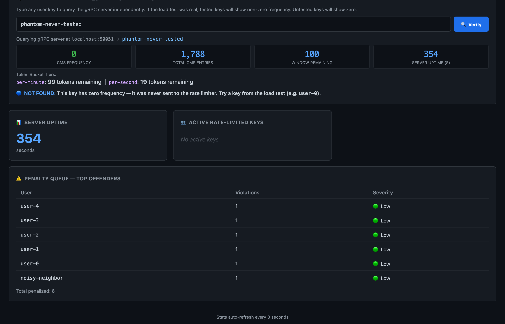

# 🛡️ SketchGate

A high-availability distributed rate limiter with penalty queues, built in Go.

## Overview

SketchGate protects SaaS APIs from DDoS attacks and noisy neighbors using advanced algorithms:

- **Count-Min Sketch** — Sub-linear space frequency estimation with error bound ε and probability 1-δ
- **Sliding Window Log** — O(1) amortized rate tracking per user
- **Hierarchical Token Bucket** — Tiered burst management (per-second, per-minute, etc.)

## Demo

### Dashboard — Load Test Console & Real-Time Results

The web dashboard lets you configure and launch load tests interactively, with live results showing allowed/denied rates, latency, throughput, and penalized users.



### Load Test with Server-Side Proof

After each test, the **Server-Side Proof** panel shows before/after state captured directly from the gRPC backend — proving every request is real. The **Request Log** displays sampled individual `CheckRate()` gRPC calls with timestamps, response status, and latency.



### DDoS / Burst Mode Simulation

Toggle **DDoS Mode** to simulate a single noisy neighbor flooding the API. The rate limiter blocks 94%+ of malicious traffic while the penalty queue tracks offenders.



### Independent Verify Tool

Query the gRPC backend directly for any user key. Tested keys show real frequency data from the Count-Min Sketch; untested keys show zero — proof the load tests are genuine.

| Tested key (`user-0`) — ✅ Confirmed | Untested key (`phantom-never-tested`) — 🔵 Not found |
|:---:|:---:|
|  |  |

## Architecture

```
┌──────────────┐     gRPC (:50051)     ┌──────────────────────┐
│  API Client  │ ──────────────────▶   │   SketchGate Server  │
└──────────────┘                       │                      │
                                       │  ┌────────────────┐  │
┌──────────────┐     HTTP (:8080)      │  │ Token Bucket   │  │
│  Dashboard   │ ◀─────────────────    │  │ Sliding Window │  │
└──────────────┘                       │  │ Count-Min Sketch│  │
                                       │  └───────┬────────┘  │
                                       └──────────┼───────────┘
                                                   │
                                       ┌───────────▼───────────┐
                                       │   Redis (Sorted Sets, │
                                       │   Lua Scripts, Keys)  │
                                       └───────────────────────┘
```

- **Go service** with gRPC API (6 RPCs) and gRPC reflection
- **Redis** for distributed state with atomic Lua scripts
- **Graceful degradation** — runs in-memory if Redis is unavailable
- **Penalty queue** — automatically penalizes repeat offenders

## Project Structure

```
SketchGate/
├── algorithms/          # Core algorithm implementations + tests
│   ├── countmin.go          # Count-Min Sketch (frequency estimation)
│   ├── slidingwindow.go     # Sliding Window Log (rate tracking)
│   ├── tokenbucket.go       # Hierarchical Token Bucket (burst control)
│   └── *_test.go            # 16 tests + benchmarks
├── redis/               # Redis integration layer
│   ├── client.go            # Connection management
│   ├── ratelimit.go         # Atomic sliding window (Lua script)
│   ├── countmin_store.go    # Distributed CMS store
│   └── penalty.go           # Penalty queue (sorted sets)
├── proto/               # Protobuf definitions + generated code
│   └── sketchgate.proto     # gRPC API definition
├── service/             # gRPC service implementation
│   └── server.go            # Wires algorithms + Redis together
├── cmd/server/          # Server entry point
│   └── main.go
├── clients/             # Test and demo clients
│   ├── demo/main.go         # Interactive demo of all RPCs
│   └── loadtest/main.go     # Load tester with DDoS simulation
├── ui/                  # Web dashboard
│   ├── main.go              # Go HTTP server with live dashboard
│   └── Dockerfile
└── docker-compose.yml   # Redis + Dashboard setup
```

## Quick Start

### Option 1: Docker (Redis + Dashboard)

```bash
docker-compose up --build
# Dashboard → http://localhost:8080
# Redis → localhost:6379
```

### Option 2: Local Development

```bash
# 1. Start Redis
docker run -d -p 6379:6379 redis:7-alpine

# 2. Start the gRPC server
go run cmd/server/main.go

# 3. Start the dashboard (separate terminal)
cd ui && go run main.go

# 4. Run the demo client
go run clients/demo/main.go

# 5. Run a load test (100 req/s across 10 users for 10s)
go run clients/loadtest/main.go -rps 100 -users 10 -duration 10s

# 6. Simulate a DDoS / noisy neighbor
go run clients/loadtest/main.go -burst -rps 500 -duration 5s
```

## gRPC API

| RPC | Description |
|-----|-------------|
| `CheckRate` | Check if a request is allowed under rate limits |
| `GetStatus` | Get full rate limit status for a user key |
| `GetPenaltyQueue` | List top offending users |
| `PardonUser` | Remove a user from the penalty queue |
| `EstimateFrequency` | Get CMS frequency estimate for a key |
| `Health` | Service and Redis health check |

Use with [grpcurl](https://github.com/fullstorydev/grpcurl):

```bash
# Health check
grpcurl -plaintext localhost:50051 sketchgate.RateLimiter/Health

# Check rate limit
grpcurl -plaintext -d '{"key": "user1", "tokens": 1}' \
  localhost:50051 sketchgate.RateLimiter/CheckRate

# View penalty queue
grpcurl -plaintext -d '{"top_n": 10}' \
  localhost:50051 sketchgate.RateLimiter/GetPenaltyQueue
```

## Academic Analysis

### Big-O Comparison

| Data Structure | Space | Lookup | Insert |
|---------------|-------|--------|--------|
| Count-Min Sketch | O(log N) | O(d) | O(d) |
| Hash Map | O(N) | O(1) | O(1) |
| Sliding Window Log | O(W) | O(1)* | O(1)* |
| Token Bucket | O(1) | O(1) | O(1) |

*O(1) amortized with lazy cleanup

### Why Count-Min Sketch?

Provides frequency estimates with error bound ε and probability 1-δ using multiple hash functions. For N=1M users, CMS uses ~14KB vs ~40MB for a hash map — a **2,800x** space reduction.

### Why Hierarchical Token Buckets?

A single token bucket can't enforce both per-second and per-minute limits simultaneously. Hierarchical buckets stack multiple tiers — a request must pass ALL tiers to be allowed, giving fine-grained burst control.

## Configuration

Default rate limiting config (customizable via `service.Config`):

| Parameter | Default | Description |
|-----------|---------|-------------|
| Window | 1 minute | Sliding window duration |
| Request Limit | 100 | Max requests per window |
| CMS Width | 2,718 | Count-Min Sketch columns |
| CMS Depth | 5 | Count-Min Sketch hash functions |
| Penalty Threshold | 3 | Violations before auto-penalty |
| Token Bucket (fast) | 20 req/s, burst 20 | Per-second tier |
| Token Bucket (slow) | 100 req/min, burst 100 | Per-minute tier |

## License

MIT
